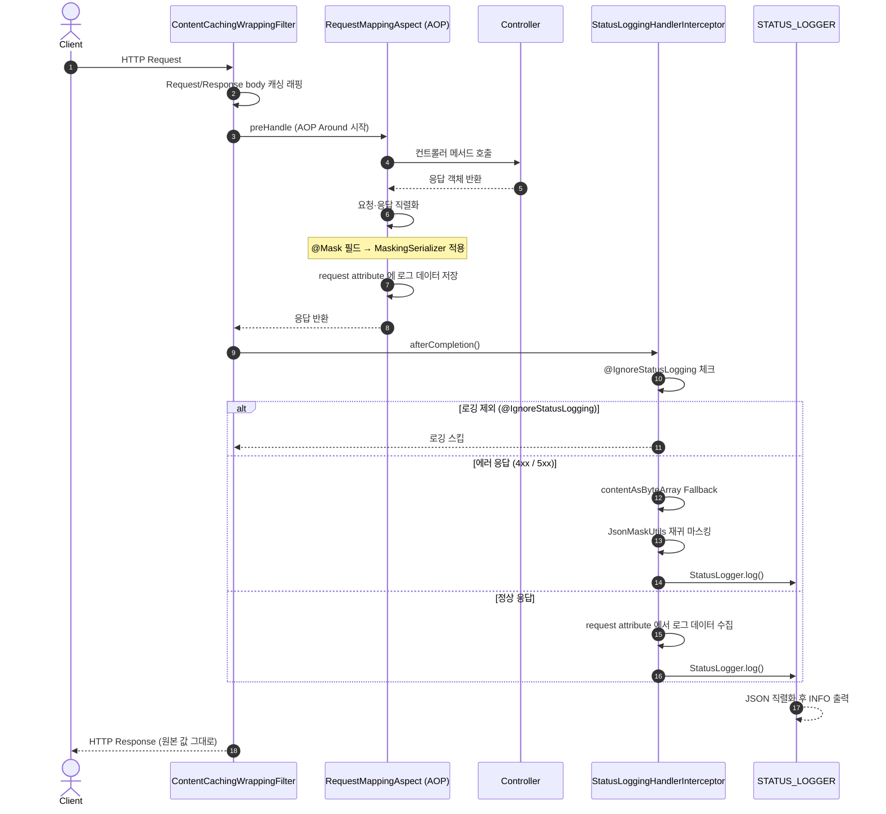
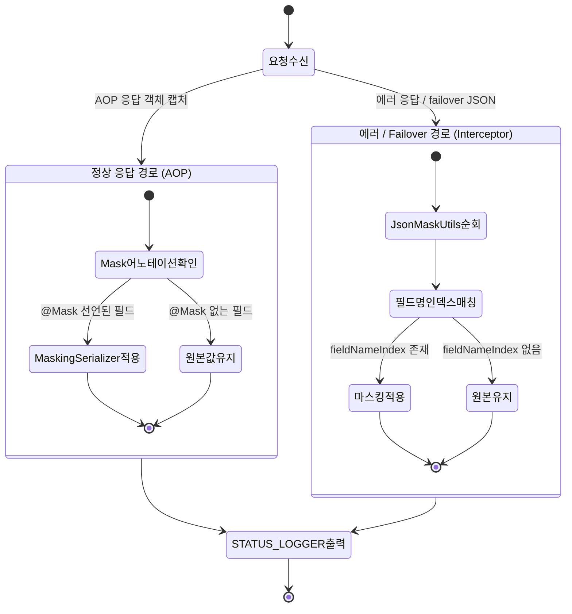
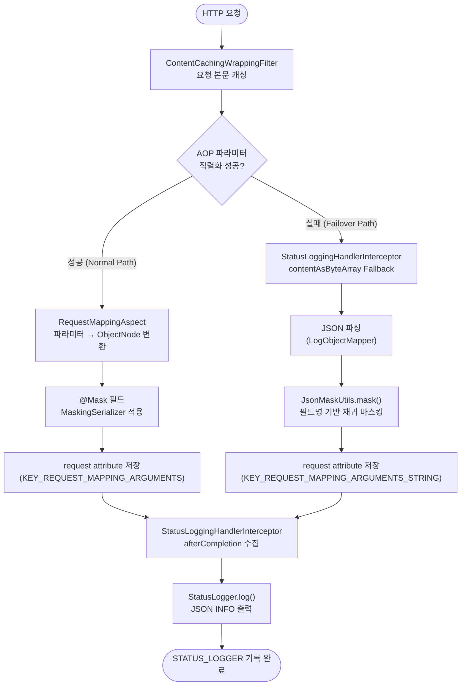

#### Spring Boot 3.2+ 기반 공통 로깅 라이브러리 (common-logging)

- **Spring Boot 3.x 호환**: Jakarta EE 기반의 최신 Spring Boot 3.2.5 환경을 완벽하게 지원
- **표준화된 로깅**: HTTP 요청/응답 상태, 페이로드(Body), 클라우드 환경 정보(Pod, Node 등)를 자동으로 수집하여 표준화된 로그를 생성
- **안전한 아키텍처**: 최신 Spring Boot의 엄격한 빈 생성 규칙을 준수하여 순환 참조 문제를 해결하고 조건부 로딩을 통해 필요한 환경에서만 활성화
- **주요정보 마스킹**: 모듈 내 @Mask 어노테이션을 활용해서 개인정보 또는 민감정보는 로그에 노출하지 않거나 마스킹되도록 지원

---

## 🚀 퀵 스타트

### 1. Gradle 의존성 추가

```kotlin
dependencies {
    implementation("com.common:common-logging:0.0.1")
}
```

### 2. application.yml 설정

```yaml
app:
  id: my-service-name           # [필수] 서비스 식별자 (로그의 service 필드)

status-logger:
  response-logging:
    enabled: false              # [선택] responseBody 로깅 활성화 (기본: false)
  content-caching:
    enabled: true               # [선택] ContentCachingWrappingFilter 활성화 (기본: true)
    ignore-path-patterns:       # [선택] 캐싱·로깅 제외 경로
      - "/actuator/**"
      - "/health"
```

### 3. 라이브러리 활성화

```kotlin
@EnableLogging // 이 어노테이션 하나로 모든 로깅 기능 활성화
@SpringBootApplication
class MyServiceApplication

fun main(args: Array<String>) {
    runApplication<MyServiceApplication>(*args)
}
```

---

## 🛠 상세 기능

### 1. 어노테이션 레퍼런스

| 어노테이션 | 적용 위치 | 설명 |
|---|---|---|
| `@EnableLogging` | 클래스 | 라이브러리 전체 빈 로드 진입점 |
| `@IgnoreStatusLogging` | 메서드 | 해당 엔드포인트를 STATUS_LOGGER 에서 제외 |
| `@StatusLoggerOption(fullBody=true)` | 메서드 | responseBody 전체를 로그에 기록 (기본은 truncated) |
| `@Mask(type = MaskType.PHONE)` | 필드 | 직렬화 시 해당 필드 값을 마스킹 |

```kotlin
@GetMapping("/health")
@IgnoreStatusLogging                    // 헬스체크 로그 제외
fun health(): String = "ok"

@GetMapping("/admin/report")
@StatusLoggerOption(fullBody = true)    // 전체 응답 body 로그
fun report(): ReportResponse = ...
```

---

### 2. 개인정보 마스킹 (`@Mask`)

DTO 필드에 `@Mask` 어노테이션을 선언하면, **API HTTP 응답은 원본 값**을 반환하고 **STATUS_LOGGER 에는 마스킹된 값**이 기록됩니다.

```kotlin
data class UserResponse(
    val id: Long,
    @Mask(MaskType.NAME)        val name: String,
    @Mask(MaskType.PHONE)       val phone: String,
    @Mask(MaskType.EMAIL)       val email: String,
    @Mask(MaskType.SSN)         val ssn: String,
    @Mask(MaskType.CARD_NUMBER) val cardNumber: String,
)
```

#### 지원 MaskType

| MaskType | 예시 입력 | 마스킹 결과 | 자동 감지 필드명 (JSON 트리) |
|---|---|---|---|
| `PHONE` | `010-1234-5678` | `010-****-5678` | `phone`, `phoneNumber`, `mobile` 등 |
| `EMAIL` | `hong@example.com` | `hon***@example.com` | `email`, `emailAddress` 등 |
| `NAME` | `홍길동` | `홍**` | `name`, `userName`, `fullName` 등 |
| `SSN` | `900101-1234567` | `900101-*******` | `ssn`, `jumin`, `rrn` 등 |
| `CARD_NUMBER` | `1234-5678-9012-3456` | `1234-****-****-3456` | `cardNumber`, `cardNo` 등 |
| `ACCOUNT_NUMBER` | `123-456789-01` | `123-******-01` | `accountNumber`, `bankAccount` 등 |
| `IP` | `192.168.1.100` | `192.168.*.*` | `ip`, `clientIp`, `ipAddress` 등 |
| `ADDRESS` | `서울특별시 강남구 역삼동 123` | `서울특별시 강남구 ***` | `address`, `roadAddress` 등 |

> **JSON 트리 마스킹**: 에러 응답처럼 이미 직렬화된 JSON 경로에서는 `@Mask` 어노테이션 대신 `MaskType.fieldNameIndex`에 등록된 **필드명을 기준으로 재귀 자동 마스킹**합니다.

---

### 3. 로그 메시지 빌더 (StatusLogMessageBuilder)

`CommonStatusLogMessageBuilder`는 시스템 환경 변수에서 클라우드 인프라 정보를 자동으로 추출합니다.

| 필드 | 환경 변수 | 설명 | 기본값 |
|---|---|---|---|
| `node` | `NODE_NAME` | K8s Node 이름 | `-` |
| `pod` | `HOSTNAME` | K8s Pod 이름 | `-` |
| `cluster` | `CLUSTER` | 클러스터 정보 | `-` |
| `version` | `VERSION` | 앱 버전 | `-` |
| `pinpointAgentId` | `PINPOINT_ID` | Pinpoint Agent ID | `-` |
| `type` | `APP_TYPE` | 앱 타입 | `-` |

`StatusLogMessageBuilder` 인터페이스를 구현한 커스텀 빈을 등록하면 기본 빌더를 교체할 수 있습니다.

---

### 4. HTTP 본문 캐싱 (ContentCachingWrappingFilter)

`HttpServletRequest` / `HttpServletResponse`를 래핑해 요청·응답 본문을 **여러 번 읽을 수 있도록 캐싱**합니다.
`ignore-path-patterns` 설정으로 헬스체크 등 불필요한 경로를 제외할 수 있습니다.

---

## 📊 로그 출력 형태 (STATUS_LOGGER)

```json
{
  "@timestamp": "2026-01-29T12:15:22.123+09:00",
  "service": "my-service",
  "phase": "production",
  "method": "GET",
  "path": "/api/v1/users/42",
  "ipath": "/api/v1/users/{id}",
  "statusCode": 200,
  "execTimemillis": 42,
  "message": "req: GET /api/v1/users/42\nres: 200 42ms\nfrom: 10.0.12.45\n",
  "requestBody": "{}",
  "responseBody": "{\"id\":42,\"name\":\"홍**\",\"phone\":\"010-****-5678\"}",
  "clientIp": "10.0.12.45",
  "node": "gke-cluster-node-01",
  "pod": "my-service-7d8f9b",
  "version": "1.2.0"
}
```

### 주요 필드 설명

| 필드 | 설명 | 비고 |
|---|---|---|
| `@timestamp` | 로그 발생 시간 | ISO 8601 |
| `service` | 서비스 식별자 | `app.id` 설정값 |
| `phase` | 실행 환경 | `spring.profiles.active` |
| `method` | HTTP Method | GET, POST, PUT 등 |
| `path` | 실제 요청 URI | Query String 포함 |
| `ipath` | HandlerMapping 패턴 경로 | `/api/v1/users/{id}` 형태 |
| `statusCode` | HTTP 상태 코드 | 200, 400, 500 등 |
| `execTimemillis` | 처리 시간 | 밀리초 단위 |
| `message` | 요약 텍스트 | req/res/from 멀티라인 |
| `requestBody` | 요청 본문 | AOP 캡처 or Failover 경로 |
| `responseBody` | 응답 본문 | `@Mask` 필드 자동 마스킹 |
| `responseMsg` | 에러 메시지 | 4xx/5xx 응답 시 포함 |
| `clientIp` | 클라이언트 IP | 마스킹 가능 (`MaskType.IP`) |
| `node` / `pod` | K8s 인프라 정보 | 환경 변수 기반 |
| `traceId` / `spanId` | 분산 추적 ID | Micrometer Tracing 연동 |

---

## 📐 아키텍처 다이어그램

### 1. HTTP 요청 처리 및 로깅 흐름



---

### 2. @Mask 마스킹 처리 분기



---

### 3. RequestBody 캡처 경로 (정상 vs Failover)


