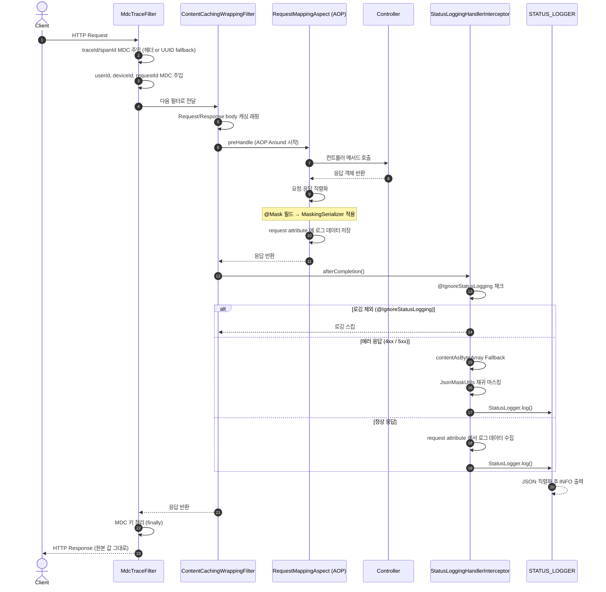
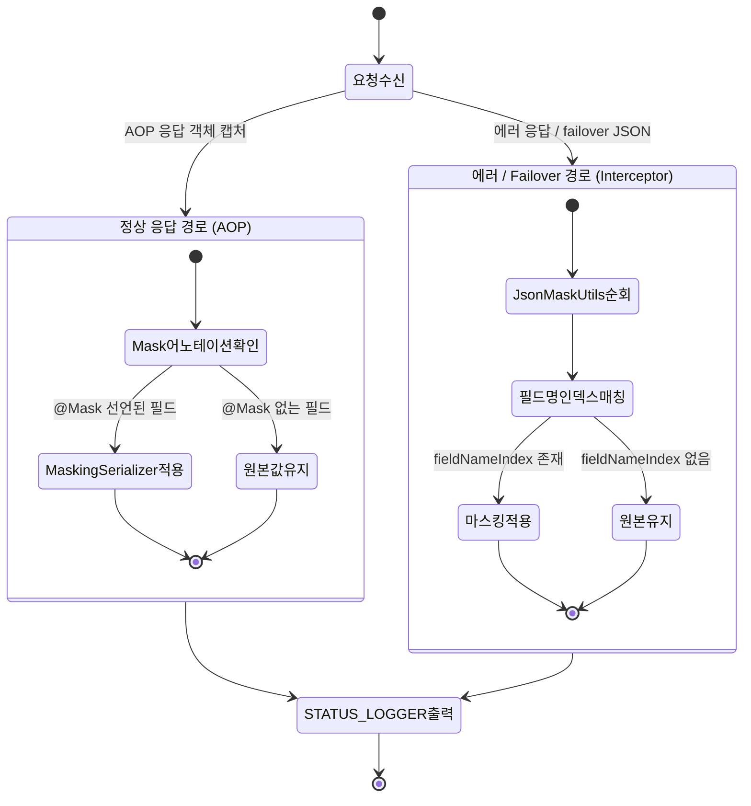
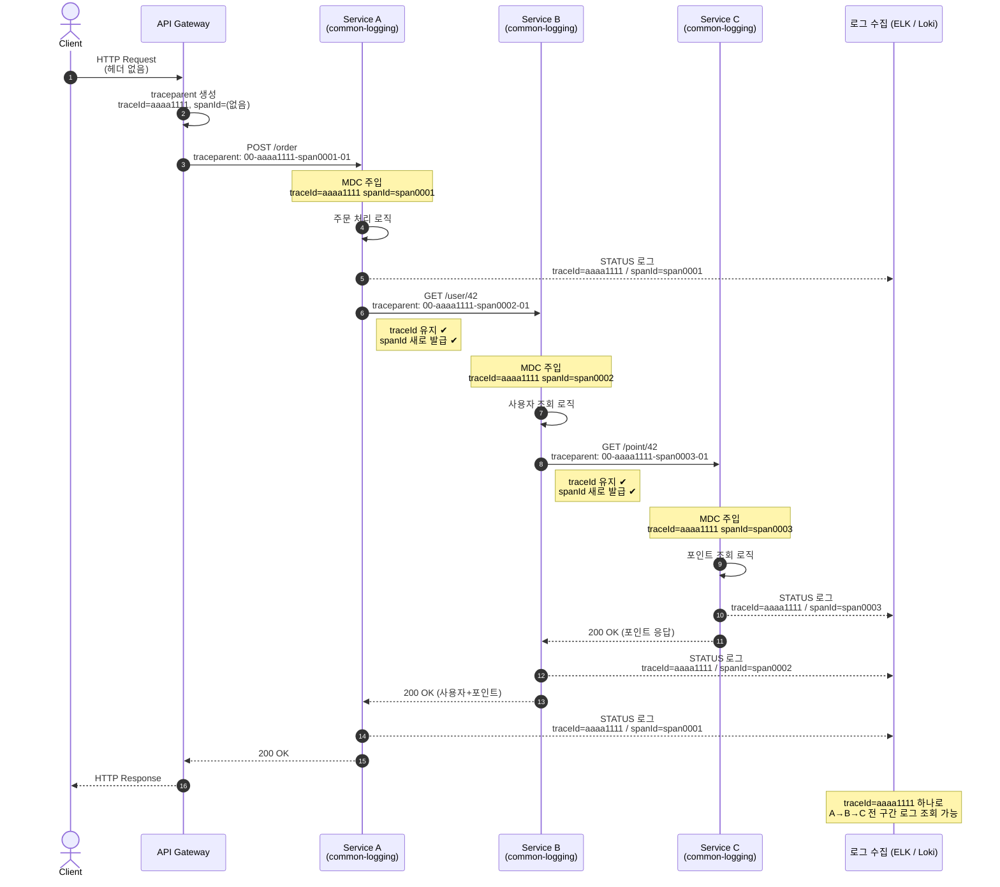

#### Spring Boot 3.2+ 기반 공통 로깅 라이브러리 (common-logging)

- **표준화된 로깅 공통화**: HTTP 요청/응답 상태, 페이로드(Body), 클라우드 환경 정보(Pod, Node 등)를 자동으로 수집하여 표준화된 로그를 생성
- **안전한 아키텍처**: 최신 Spring Boot의 엄격한 빈 생성 규칙을 준수하여 순환 참조 문제를 해결하고 조건부 로딩을 통해 필요한 환경에서만 활성화
- **주요정보 마스킹**: 모듈 내 @Mask 어노테이션을 활용해서 개인정보 또는 민감정보는 로그에 노출하지 않거나 마스킹되도록 지원
- **분산 추적**: Micrometer Tracing(Brave) 기반으로 traceId/spanId를 MDC에 자동 주입. B3/W3C 헤더 전파 및 자체 UUID fallback 지원



---

## 🚀 퀵 스타트

### 1. Gradle 의존성 추가

```kotlin
dependencies {
    implementation("com.common:common-logging:1.0.0")
}
```

### 2. 라이브러리 활성화

```kotlin
@EnableLogging          // Status Logging, Masking, Content Caching 등 전체 활성화
@EnableMDCTraceLogging  // 분산 추적 + Brave 샘플링 활성화 (Optional)
@SpringBootApplication
class MyServiceApplication

fun main(args: Array<String>) {
    runApplication<MyServiceApplication>(*args)
}
```

### 3. application.yml 설정

```yaml
app:
  id: my-service-name   # [필수] 서비스 식별자 (로그의 service 필드)
```

> `spring.cloud.config` 비활성화 등 라이브러리 기본 설정은 `CommonLoggingEnvironmentPostProcessor`가 자동으로 처리합니다 (별도 설정 불필요)

---

### 4. logback-spring.xml 설정

라이브러리는 **두 종류**의 로그를 출력합니다
Appender를 분리하여 각 형태에 맞는 패턴을 지정해주세요

#### 로그 형태 비교

| 구분 | Logger 이름 | 형태 | 설명 |
|---|---|---|---|
| **일반 로그** | (root / 각 클래스) | 텍스트 한 줄 | 개발/디버그용 콘솔 출력 |
| **STATUS 로그** | `STATUS_LOGGER` | **단일 JSON 한 줄** | HTTP 요청·응답 구조화 로그 |

#### 일반 로그 예시 (텍스트)

```
2026-01-29 12:15:22,123 INFO  http-nio-8080-exec-1 (c.c.l.c.MdcTraceFilter) [91f10b1eb1a14216:193269809b80ab12:1042] [req-uuid-1234] Started request processing
```

적용 패턴:
```xml
<pattern>%date{'yyyy-MM-dd HH:mm:ss,SSS', Asia/Seoul} %-5level %thread (%logger{15}) [%mdc{traceId:--}:%mdc{spanId:--}:%mdc{user-id:--}] [%mdc{requestId:-}] %msg%n</pattern>
```

#### STATUS 로그 예시 (단일 JSON 한 줄)

```json
{
  "@timestamp": "2026-01-29T12:15:22.123+09:00",
  "traceId": "91f10b1eb1a14216b9fa428bb119d11f",
  "spanId": "193269809b80ab12",
  "service": "my-service",
  "phase": "production",
  "method": "GET",
  "path": "/api/v1/users/42",
  "ipath": "/api/v1/users/{id}",
  "statusCode": 200,
  "execTimemillis": 42,
  "message": "req: GET /api/v1/users/42\nres: 200 42ms\nfrom: 10.0.12.45\n",
  "requestBody": "{}",
  "responseBody": "{\"id\":42,\"name\":\"홍**\",\"phone\":\"010-****-5678\"}",
  "clientIp": "10.0.12.45",
  "node": "gke-cluster-node-01",
  "pod": "my-service-7d8f9b",
  "version": "1.2.0"
}
```

> `message` 필드 안의 개행(`\n`) 등 특수문자는 `EscapedPatternLayout`이 JSON-safe하게 자동 이스케이프합니다.

적용 패턴 (`EscapedPatternLayout` + `%metric` 컨버터 사용):
```xml
<pattern>{"@timestamp":"%date{yyyy-MM-dd'T'HH:mm:ss.SSSXXX, Asia/Seoul}","level":"%level","thread":"%thread","logger":"%logger{36}","traceId":"%mdc{traceId:-}","spanId":"%mdc{spanId:-}","message":%metric}</pattern>
```

> **`%metric` 컨버터**: `EscapedPatternLayout` 전용. STATUS_LOGGER가 출력하는 **JSON 문자열을 그대로 삽입**하기 위해 탭·개행·따옴표만 이스케이프합니다 (`customJsonSafeReplace`) `%msg` / `%message` 는 모든 특수문자를 완전 이스케이프하므로 STATUS_LOGGER 에는 사용하지 마세요

#### logback-spring.xml 전체 예시

```xml
<?xml version="1.0" encoding="UTF-8"?>
<configuration>
    <!--
        springProperty 로 application.yml 값을 참조하거나 defaultValue 로 기본값 지정
        MDC 키: traceId, spanId (MdcTraceFilter), user-id (X-User-Id), requestId (X-Request-Id)
    -->
    <springProperty scope="context" name="LOGBACK_STDOUT_PATTERN"
                    source="logging.patterns.stdout"
                    defaultValue="%date{'yyyy-MM-dd HH:mm:ss,SSS', Asia/Seoul} %-5level %thread %r \(%logger{15}\) [%mdc{traceId:--}:%mdc{spanId:--}:%mdc{user-id:--}] [%mdc{requestId:-}] %msg%n"/>

    <springProperty scope="context" name="LOGBACK_STATUS_PATTERN"
                    source="logging.patterns.status"
                    defaultValue="{&quot;@timestamp&quot;:&quot;%date{yyyy-MM-dd'T'HH:mm:ss.SSSXXX, Asia/Seoul}&quot;,&quot;level&quot;:&quot;%level&quot;,&quot;thread&quot;:&quot;%thread&quot;,&quot;logger&quot;:&quot;%logger{36}&quot;,&quot;traceId&quot;:&quot;%mdc{traceId:-}&quot;,&quot;spanId&quot;:&quot;%mdc{spanId:-}&quot;,&quot;message&quot;:%metric}"/>

    <!-- 일반 콘솔 출력 -->
    <appender name="STDOUT" class="ch.qos.logback.core.ConsoleAppender">
        <encoder>
            <pattern>${LOGBACK_STDOUT_PATTERN}</pattern>
        </encoder>
    </appender>

    <!-- STATUS_LOGGER 전용 JSON 출력 (EscapedPatternLayout 필수) -->
    <appender name="STATUS_JSON" class="ch.qos.logback.core.ConsoleAppender">
        <encoder class="ch.qos.logback.core.encoder.LayoutWrappingEncoder">
            <layout class="com.common.logging.common.EscapedPatternLayout">
                <pattern>${LOGBACK_STATUS_PATTERN}</pattern>
            </layout>
        </encoder>
    </appender>

    <!-- STATUS_LOGGER: JSON appender만, root로 전파하지 않음 -->
    <logger name="STATUS_LOGGER" level="INFO" additivity="false">
        <appender-ref ref="STATUS_JSON"/>
    </logger>

    <root level="INFO">
        <appender-ref ref="STDOUT"/>
    </root>
</configuration>
```

#### MDC 패턴 토큰 레퍼런스

| 토큰 | MDC 키 | 값 출처 |
|---|---|---|
| `%mdc{traceId:--}` | `traceId` | W3C / B3 헤더 또는 UUID 자동 생성 |
| `%mdc{spanId:--}` | `spanId` | W3C / B3 헤더 또는 UUID 자동 생성 |
| `%mdc{user-id:--}` | `user-id` | `X-User-Id` 요청 헤더 |
| `%mdc{requestId:-}` | `requestId` | `X-Request-Id` 헤더 또는 UUID 자동 생성 |

> 기본값 구분자: `:-` (빈 문자열 대체) / `:--` (대시(`-`) 대체)

---

## 🛠 상세 기능

### 1. 어노테이션 레퍼런스

| 어노테이션 | 적용 위치 | 설명 |
|---|---|---|
| `@EnableLogging` | 클래스 | STATUS_LOGGER, AOP, 필터 등 라이브러리 전체 빈 로드 |
| `@EnableMDCTraceLogging` | 클래스 | Brave Sampler(100%) 등록 + MDC traceId/spanId 자동 주입 |
| `@IgnoreStatusLogging` | 메서드 | 해당 엔드포인트를 STATUS_LOGGER 에서 제외 |
| `@StatusLoggerOption(fullBody=true)` | 메서드 | responseBody 전체를 로그에 기록 (기본은 truncated) |
| `@Mask(type = MaskType.PHONE)` | 필드 | 직렬화 시 해당 필드 값을 마스킹 |

```kotlin
@GetMapping("/health")
@IgnoreStatusLogging // 헬스체크 로그 제외
fun health(): String = "ok"

@GetMapping("/admin/report")
@StatusLoggerOption(fullBody = true) // 전체 응답 body 로그
fun report(): ReportResponse = ...
```

---

### 2. 개인정보 마스킹 (`@Mask`)

DTO 필드에 `@Mask` 어노테이션을 선언하면, **API HTTP 응답은 원본 값**을 반환하고 **STATUS_LOGGER 에는 마스킹된 값**이 기록됩니다.

```kotlin
data class UserResponse(
    val id: Long,
    @Mask(MaskType.NAME)        val name: String,
    @Mask(MaskType.PHONE)       val phone: String,
    @Mask(MaskType.EMAIL)       val email: String,
    @Mask(MaskType.SSN)         val ssn: String,
    @Mask(MaskType.CARD_NUMBER) val cardNumber: String,
)
```

#### 지원 MaskType

| MaskType | 예시 입력 | 마스킹 결과 | 자동 감지 필드명 (JSON 트리) |
|---|---|---|---|
| `PHONE` | `010-1234-5678` | `010-****-5678` | `phone`, `phoneNumber`, `mobile` 등 |
| `EMAIL` | `hong@example.com` | `hon***@example.com` | `email`, `emailAddress` 등 |
| `NAME` | `홍길동` | `홍**` | `name`, `userName`, `fullName` 등 |
| `SSN` | `900101-1234567` | `900101-*******` | `ssn`, `jumin`, `rrn` 등 |
| `CARD_NUMBER` | `1234-5678-9012-3456` | `1234-****-****-3456` | `cardNumber`, `cardNo` 등 |
| `ACCOUNT_NUMBER` | `123-456789-01` | `123-******-01` | `accountNumber`, `bankAccount` 등 |
| `IP` | `192.168.1.100` | `192.168.*.*` | `ip`, `clientIp`, `ipAddress` 등 |
| `ADDRESS` | `서울특별시 강남구 역삼동 123` | `서울특별시 강남구 ***` | `address`, `roadAddress` 등 |

> **JSON 트리 마스킹**: 에러 응답처럼 이미 직렬화된 JSON 경로에서는 `@Mask` 어노테이션 대신 `MaskType.fieldNameIndex`에 등록된 **필드명을 기준으로 재귀 자동 마스킹**합니다.



---

### 3. 분산 추적 (MDC Tracing)

`MdcTraceFilter`가 모든 HTTP 요청에 대해 traceId / spanId를 MDC에 주입합니다.

#### 트레이스 헤더 우선순위

```
W3C traceparent  →  B3 Single (b3)  →  B3 Multi (X-B3-TraceId / X-B3-SpanId)  →  UUID 자동 생성
```

- 인입 헤더가 있으면 해당 값을 그대로 MDC에 전파
- Micrometer가 MDC에 이미 주입한 값이 있으면 그대로 사용
- 아무것도 없으면 UUID 32자리(traceId) + 16자리(spanId)를 자동 생성

#### 커스텀 MDC 헤더

| 요청 헤더 | MDC 키 | 설명 |
|---|---|---|
| `X-User-Id` | `user-id` | 사용자 ID (Long 변환 가능 시 request attribute에도 저장) |
| `X-Device-Id` | `device-id` | 디바이스 ID |
| `X-Request-From` | `request-from` | 요청 출처 |
| `X-Request-Id` | `requestId` | 요청 추적 ID (없으면 UUID 자동 생성) |

#### Logback 패턴

```
%date %-5level %thread (%logger{15}) [%mdc{traceId:--}:%mdc{spanId:--}:%mdc{user-id:--}] [%mdc{requestId:-}] %msg%n
```

#### 운영 환경 샘플링 조정

`@EnableMDCTraceLogging`은 기본으로 100% 샘플링(ALWAYS_SAMPLE)을 적용합니다. 운영 환경에서 비율을 낮추려면 어노테이션 없이 아래 프로퍼티를 직접 사용하세요.

```yaml
management:
  tracing:
    sampling:
      probability: 0.1   # 10% 샘플링
```

#### 서비스 간 traceId/spanId 전파 흐름



| 항목 | 동작 |
|---|---|
| **traceId** | 최초 생성 후 모든 서비스에서 **동일하게 유지** |
| **spanId** | 서비스 경계를 넘을 때마다 **새로 발급** — 각 구간을 식별 |
| **전파 헤더** | `traceparent: 00-{traceId}-{spanId}-01` (W3C 표준) |
| **MDC 주입** | 각 서비스의 `MdcTraceFilter`가 헤더에서 읽어 MDC에 저장 |
| **로그 조회** | 로그 수집 시스템에서 `traceId`로 필터링 → 전 구간 한눈에 확인 |

---

### 4. 로그 메시지 빌더 (StatusLogMessageBuilder)

`CommonStatusLogMessageBuilder`는 시스템 환경 변수에서 클라우드 인프라 정보를 자동으로 추출합니다.

| 필드 | 환경 변수 | 설명 | 기본값 |
|---|---|---|---|
| `node` | `NODE_NAME` | K8s Node 이름 | `-` |
| `pod` | `HOSTNAME` | K8s Pod 이름 | `-` |
| `cluster` | `CLUSTER` | 클러스터 정보 | `-` |
| `version` | `VERSION` | 앱 버전 | `-` |
| `pinpointAgentId` | `PINPOINT_ID` | Pinpoint Agent ID | `-` |
| `type` | `APP_TYPE` | 앱 타입 | `-` |

`StatusLogMessageBuilder` 인터페이스를 구현한 커스텀 빈을 등록하면 기본 빌더를 교체할 수 있습니다.

---

### 5. HTTP 본문 캐싱 (ContentCachingWrappingFilter)

`HttpServletRequest` / `HttpServletResponse`를 래핑해 요청·응답 본문을 **여러 번 읽을 수 있도록 캐싱**합니다.
`ignore-path-patterns` 설정으로 헬스체크 등 불필요한 경로를 제외할 수 있습니다.


---

## 📊 로그 출력 형태 (STATUS_LOGGER)

```json
{
  "@timestamp": "2026-01-29T12:15:22.123+09:00",
  "traceId": "91f10b1eb1a14216b9fa428bb119d11f",
  "spanId": "193269809b80ab12",
  "service": "my-service",
  "phase": "production",
  "method": "GET",
  "path": "/api/v1/users/42",
  "ipath": "/api/v1/users/{id}",
  "statusCode": 200,
  "execTimemillis": 42,
  "message": "req: GET /api/v1/users/42\nres: 200 42ms\nfrom: 10.0.12.45\n",
  "requestBody": "{}",
  "responseBody": "{\"id\":42,\"name\":\"홍**\",\"phone\":\"010-****-5678\"}",
  "clientIp": "10.0.12.45",
  "node": "gke-cluster-node-01",
  "pod": "my-service-7d8f9b",
  "version": "1.2.0"
}
```

### 주요 필드 설명

| 필드 | 설명 | 비고 |
|---|---|---|
| `@timestamp` | 로그 발생 시간 | ISO 8601 |
| `traceId` | 분산 추적 ID | 헤더 전파 또는 UUID 자동 생성 |
| `spanId` | 분산 추적 Span ID | 헤더 전파 또는 UUID 자동 생성 |
| `service` | 서비스 식별자 | `app.id` 설정값 |
| `phase` | 실행 환경 | `spring.profiles.active` |
| `method` | HTTP Method | GET, POST, PUT 등 |
| `path` | 실제 요청 URI | Query String 포함 |
| `ipath` | HandlerMapping 패턴 경로 | `/api/v1/users/{id}` 형태 |
| `statusCode` | HTTP 상태 코드 | 200, 400, 500 등 |
| `execTimemillis` | 처리 시간 | 밀리초 단위 |
| `message` | 요약 텍스트 | req/res/from 멀티라인 |
| `requestBody` | 요청 본문 | AOP 캡처 or Failover 경로 |
| `responseBody` | 응답 본문 | `@Mask` 필드 자동 마스킹 |
| `responseMsg` | 에러 메시지 | 4xx/5xx 응답 시 포함 |
| `clientIp` | 클라이언트 IP | 마스킹 가능 (`MaskType.IP`) |
| `node` / `pod` | K8s 인프라 정보 | 환경 변수 기반 |

